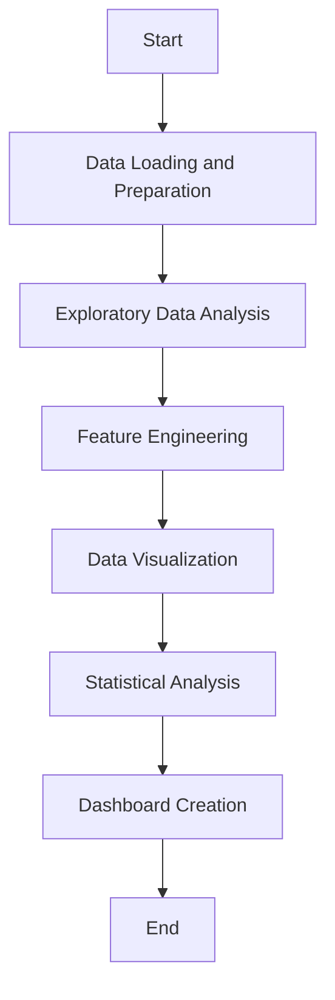

# Global Happiness Dashboard


## Author
Ruby Poddar

## Objective
The project aims to analyze global happiness scores using various data visualization techniques and statistical tests. The goal is to gain insights into factors influencing happiness across different countries.

## Tools and Libraries Used
- **Python**: Programming language used for data manipulation, analysis, and visualization.
- **Pandas**: Library for data manipulation and analysis in Python.
- **Matplotlib**: Library for creating static, animated, and interactive visualizations in Python.
- **Seaborn**: Statistical data visualization library based on Matplotlib.
- **Plotly**: Library for interactive, web-based visualization.
- **Dash**: Framework for building analytical web applications.

## Steps Covered

### Data Loading and Preparation
1. Loaded the dataset containing global happiness scores.
2. Checked for missing values and handled them as necessary.
3. Converted data types to ensure consistency and accuracy.

### Exploratory Data Analysis (EDA)
1. Conducted summary statistics to understand the distribution of happiness scores.
2. Visualized data using histograms, scatter plots, and correlation matrices to explore relationships between variables.

### Feature Engineering
1. Created new features based on existing data to derive additional insights.

### Data Visualization
1. Utilized Matplotlib and Seaborn to visualize relationships and distributions in the data.
2. Generated scatter plot matrices and heatmaps to analyze correlations between variables.

### Statistical Analysis
1. Performed statistical tests such as ANOVA to examine significant differences between groups of data.

### Dashboard Creation
1. Used Dash and Plotly to create an interactive web-based dashboard.
2. Designed the dashboard to display key visualizations dynamically, allowing users to explore data interactively.

## Flowchart


## Conclusion
Through this project, we gained valuable insights into global happiness trends and factors influencing happiness scores across countries. The combination of data exploration, visualization techniques, and statistical analysis provided a comprehensive understanding of the dataset. The interactive dashboard created using Dash and Plotly enables users to explore and interpret the data effectively.

## Future Recommendations
- Expand the dataset to include more years or additional factors influencing happiness.
- Implement machine learning models for predictive analysis of happiness scores.
- Enhance the dashboard with more interactive features and real-time data updates for ongoing analysis.

## License
This project is licensed under the MIT Public License .

## How to Run the Project
1. Clone the repository:
    ```sh
    git clone https://github.com/rubypoddar/HappinessScoreVisualizer.git
    ```
2. Navigate to the project directory:
    ```sh
    cd HappinessScoreVisualizer
    ```
3. Install the required dependencies:
    ```sh
    pip install -r requirements.txt
    ```
4. Run the dashboard:
    ```sh
    python app.py
    ```

## Dependencies
- Python 3.8+
- Pandas 1.3.3
- Matplotlib 3.4.3
- Seaborn 0.11.2
- Plotly 5.1.0
- Dash 1.21.0

## Contact
If you have any questions or suggestions, feel free to contact me at [rubypoddar101@gmail.com](mailto:rubypoddar101@gmail.com).

---

